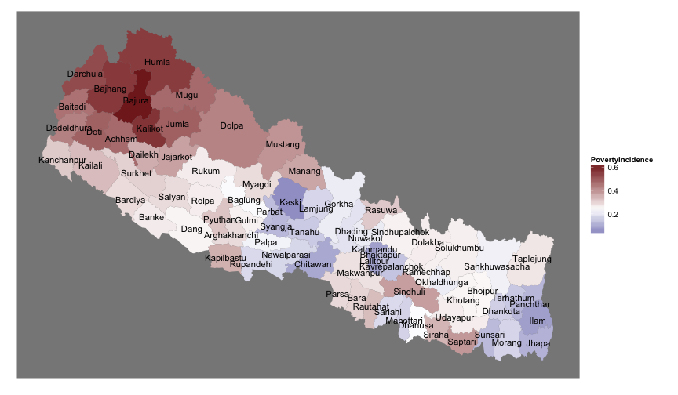
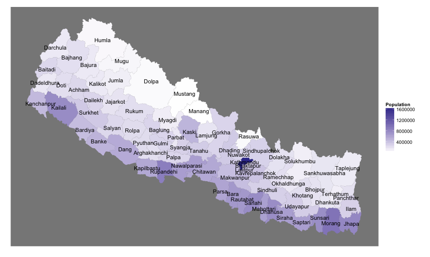

Poverty by District in Nepal, mapped
---

Chandan Sapkota, who one of my friend Bigyan calls the "Ezra Klein of Nepal", produces amazing analysis about Nepal, taking data sources from the obscure reports of government institutions and writing them up in accessible blog posts. When he posted about ["Poverty by District in Nepal"](http://sapkotac.blogspot.com/2013/07/poverty-by-district-in-nepal.html), I thought that I'd map the poverty, since it is hard for me to place all the districts in Nepal, and I wanted to see what the visual spread of poverty was. CSV data was digitized from [link in article to the CBS source](http://cbs.gov.np/wp-content/uploads/2014/06/Small%20Area%20Estimates%20of%20Poverty,%202011.pdf) (thanks Chandan for linking to the data source!), with two district spelling corrections done by author.

So lets load the data and the "NepalMapUtils" R file to get started.

## 0. Data preparation

Lets load up the data and our map convenience functions. This works fine if you do a [setwd] to inside the "SmallAreaPoverty" folder within [NepalMaps](http://github.com/prabhasp/NepalMaps).

```r
poverty <- read.csv("SmallAreaPovertyEstimation.csv")
source("../NepalMapUtils.R")
```


We will do one tranformation before proceeding, which is to rename our columns. In the dataset, "FGT(0)" (which loads in R as `FGT.0.` because R doesn't like parentheses) is the _poverty incidence_ metric, defined as proportion of individuals living in that area who are in households with an average per capita expenditure below the poverty line. FGT(1) is the _poverty gap_, which is the average distance below the poverty line, being zero for those individuals above the line, and FGT(2) is _poverty severity_, the squared distance for those below hte line, which gives more weight to the very poor. [source]

So lets go ahead and rename our columns to these understandable names:


```r
names(poverty)
```

```
## [1] "District"   "Population" "FGT.0."     "S.E.FGT.0." "FGT.1."    
## [6] "S.E.FGT.1." "FGT.2."     "S.E.FGT.2."
```

```r
names(poverty) <- c("District", "Population", "PovertyIncidence", "S.E-P.I.", 
    "PovertyGap", "S.E-P.G.", "PovertySeverity", "S.E-P.S.")
```


## 1. Poverty Incidence (2011)

 Lets make a quick map of it (note that I haven't paid attention to map projections: these are sketches).

```r
npchoropleth(poverty, "District", "PovertyIncidence")
```

 


A second map, coloring those that are above the mean (weighted by population) as blue and those below as red:

```r
meanpoverty <- weighted.mean(poverty$PovertyIncidence, poverty$Population)
npchoropleth(poverty, "District", "PovertyIncidence") + scale_fill_gradient2(low = muted("blue"), 
    midpoint = meanpoverty, mid = "white", high = muted("red"))
```

 


In the second map, you can really see how (1) the far west and the western moutains are really hurting and (2) prosperity is pretty spatial: swaths of prosperity in the Kathmandu valley, the  Gandaki-Narayani anchal area (with Kaski (where Pokhara is) and Chitwan dominating), in the very east, and in Sarlahi / Mahottari (probably from Birgunj).

## 2. Absolute poor (2011)

The next thing to look at, as Chandan did, is the number of absolute poor, which is easily calculable given that population is nicely included in this dataset. Lets have a look:

```r
poverty$AbsolutePoor <- poverty$Population * poverty$PovertyIncidence
npchoropleth(poverty, "District", "AbsolutePoor")
```

 

The absolute poor are concentrated in swatches of the Tarai, and you see quite a bit of absolute poor in the far west, even though populations are smaller, because of such a high concentration of the poor there. Note that the Kathmandu valley doesn't fare all that well, even though there is relative prosperity there; it just has a LOT of people living there.

For reference, a population sketch to remind us where people live in Nepal:

```r
npchoropleth(poverty, "District", "Population")
```

 

